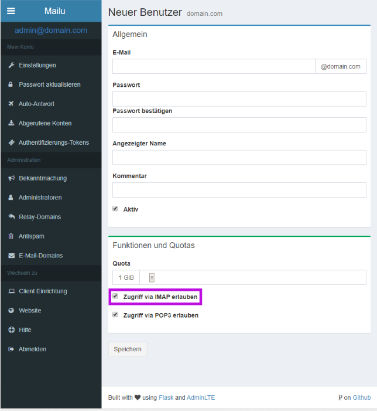

Setup
=====

## Mailu
This project comes with an integrated Mailu serivce. The web backend to manage e-mail settings can be accessed with the default settings by navigating to mail.yourdomain.com/admin.
The default admin user is *admin@yourdomain.com* with the password *password*. We strongly advise to change `INITIAL_ADMIN_ACCOUNT`, `INITIAL_ADMIN_DOMAIN`, and `INITIAL_ADMIN_PW` before the first time starting the servers.  

To create a new syncronized user, navigate in the Mailu admin panel to `E-Mail-Domains`, and click on the mail icon on your domain. There the button `New User` is located. Fill in all the details and make sure IMAP is enabled for this account (See image below).

### Mail setup
Nextcloud comes with an integrated Mail app, which is enabled by default. Besides the Nextcloud E-Mail interface, the mail account can be accessed by every mail application which can handle IMAP or POP3 (Outlook, Thunderbird, Android & iOS Mail apps).

You will find configuration details under Client Setttings in Mailu (mail.yourdomain.com/admin/ui/client)

## Nextcloud 
We decided to host nextcloud by default under the subdomain *cloud* to allow the main domain to be free to serve your website. How to host a website in this context is explained in [HOWTO Website](HOWTO_WEBSITE.md).

Users created in the Mailu backend automatically get syncronised to nextcloud and can login using their full e-mail and IMAP password.

## Riot 

IMAP users created in Mailu also have the possiblitity to log into Riot using the IMAP password.
In Riot the login type is *username*, and the username is the first part of the e-mail address. The username for the e-mail account *willi.woka@chocolate.com* would be *willi.wonka*.

